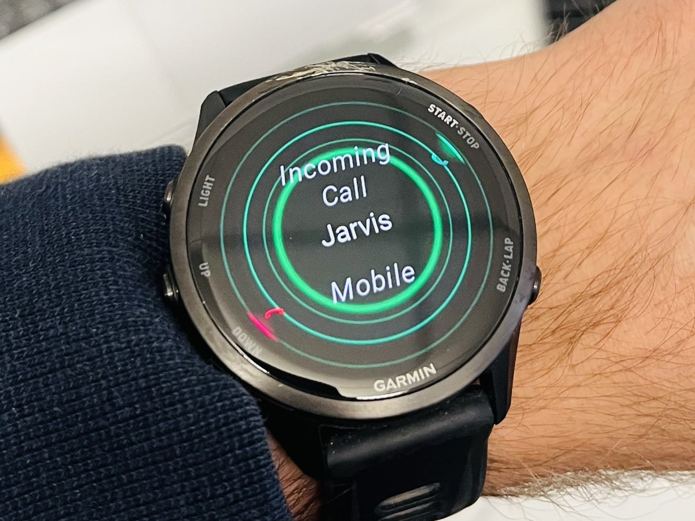

<p align="center">
  
</p>

<h1 align="center">Jarvis</h1>

<p align="center"><em>A personal voice agent that keeps working after you hang up.</em></p>

<p align="center">
  <a href="https://github.com/wak31415/jarvis-voice-agent/actions/workflows/ci.yml"></a>
  <a href="LICENSE"></a>
  
  
</p>

Start hours of work in a short call. Ask Jarvis to research a question, change code, or run
an experiment, then hang up. It keeps working, lets you check in or add instructions later,
and can call you back or text you the report when it's done.

Jarvis uses the OpenAI Realtime API for conversation and coding agents on your machine for
the work. Call it from a phone or a watch that can place calls.

<p align="center">
  
</p>

## What Jarvis adds

Jarvis turns the [Realtime API](https://developers.openai.com/api/docs/guides/realtime) into
a voice agent you can use across calls:

| Feature | Realtime API | ChatGPT Voice | Jarvis |
| --- | :---: | :---: | :---: |
| Live voice conversation and tools | ✅ | ✅ | ✅ Uses Realtime API |
| Phone calls, including from calling watches | 🟡 SIP setup | 🟡 1-800-CHATGPT, US/CA | ✅ |
| Email, calendar and Slack by voice | 🟡 via MCP | ✅ | ✅ |
| **Tasks that continue after you hang up** | — | ✅ in Work | ✅ |
| Status and follow-ups in a later call | — | 🟡 in the app | ✅ |
| SMS links to written reports | — | — | ✅ |
| Callbacks when you ask for one | — | — | ✅ |
| Pro-actively calls you when it needs input from you | — | — | ✅ |
| Ask it to add a feature during a call | — | — | ✅ |
| Report a bug in Jarvis by voice, filed as a GitHub issue | — | — | ✅ |
| Answer Claude Code prompts on your screen by phone | — | — | ✅ |

For example:

> *"In the imaging project, run a learning-rate sweep on the microscopy images. Call me if
> you need a decision, and again when training finishes with a quick summary of the results."*

> *"Find the papers my group emailed this week, turn them into a reading-group presentation
> with polished animations and some discussion questions, and send it to me on Slack."*

> *"Add a voice command that checks whether my home server is up. Build it in the Jarvis
> project and run the tests."*

> *"One more thing: include GPU memory use in that sweep comparison."*

## A short call, a long task

This example shows a task continuing across calls: Jarvis asks one question, then calls
again with the training results.

<picture>
  <source media="(prefers-color-scheme: dark)" srcset="docs/assets/jarvis-call-flow-dark.svg">
  
</picture>

## Quick start

You need Python 3.12, [uv](https://docs.astral.sh/uv/), an OpenAI API key with Realtime
access, a Twilio number, and Claude Code or Codex. Install it on a machine that stays on,
such as a desktop or home server where your projects live: Jarvis answers your calls, keeps
working after you hang up and calls you back, and none of that happens while it sleeps.

```bash
git clone https://github.com/wak31415/jarvis-voice-agent.git && cd jarvis-voice-agent
uv run jarvis setup
```

`jarvis setup` asks only for what is still missing. When it's done, call your Twilio number.
If a coding agent is setting Jarvis up for you, point it at
`uv run jarvis setup --agent-instructions`, or give Claude Code the `skills/jarvis-setup`
skill. The full walkthrough is on the [wiki](https://github.com/wak31415/jarvis-voice-agent/wiki/Setup).

## Claude Code or Codex

Jarvis hands its work to [Claude Code](https://docs.anthropic.com/en/docs/claude-code) or
[Codex](https://developers.openai.com/codex), signed in with a subscription or an API key.
It is most extensively tested with Claude Code on a subscription; other agents are supported
in principle, but may not have full feature parity. `jarvis setup` asks which one to use by
default. If you enable both, you can say "have Codex do it" on a call.
[docs/agents.md](docs/agents.md) compares the two.

## GPT-Live

[GPT-Live](https://developers.openai.com/api/docs/guides/live) (September 2026) is a
promising fit for Jarvis. It listens while it speaks, keeps the conversation going while a
backend works, and splits the job the way Jarvis already does: a voice in front, and an
agent behind it doing the reasoning and calling the tools. I'm looking into moving Jarvis
onto it, and am working out whether that can be done without losing any features. Until
then, Jarvis runs on the Realtime API. The reasons why it's not as simple as switching out
the model name:

- **Tools.** On GPT-Live the voice doesn't call tools itself: every tool goes through the
  delegated backend. The PIN, the keypad and the callbacks have to hold up there, and quick
  answers like "what's running?" have to stay quick.
- **Timing and wording.** Jarvis needs to know when a spoken reply ends, to hang up after
  goodbye and to stop talking when you interrupt. It also relies on exact wording.
  GPT-Live has no end-of-reply event, and it paraphrases the text it is handed.
- **Instructions mid-call.** Giving the PIN changes what a call may do, and Jarvis rewrites
  the voice's instructions to match. GPT-Live fixes its instructions when the call starts
  and only accepts additions after that.

## Documentation

- [Setup](https://github.com/wak31415/jarvis-voice-agent/wiki/Setup): phone, Google, the PIN, where files live, costs
- [Configuration](docs/configuration.md): every setting
- [Coding agents](docs/agents.md): signing in, installing only one, what each can do
- [Tools](docs/tools.md): what the voice model can do, and how to add a tool
- [Approval bridge](https://github.com/wak31415/jarvis-voice-agent/wiki/The-Approval-Bridge): answer Claude Code prompts on your screen by phone
- [Security](SECURITY.md): the threat model. Read it before putting the phone line online
- [Wiki](https://github.com/wak31415/jarvis-voice-agent/wiki): troubleshooting and worked
  examples
- [Contributing](CONTRIBUTING.md)

Licensed under [Apache 2.0](LICENSE).
