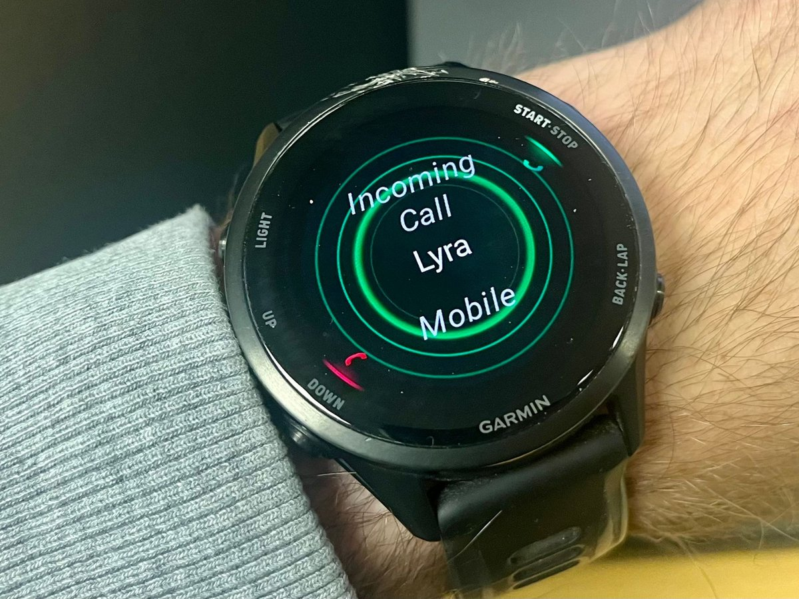

<p align="center">
  
</p>

<h1 align="center">Keryx</h1>

<p align="center"><em>A personal voice agent that keeps working after you hang up.</em></p>

<p align="center">
  <a href="https://github.com/wak31415/keryx/actions/workflows/ci.yml"></a>
  <a href="LICENSE"></a>
  
  
</p>

Start hours of work in a short phone call. Ask Lyra, the assistant on the line, to research
a question, change code, or run an experiment, then hang up. The work continues on your
machine. You can check in or add instructions in a later call, and Keryx can call you back
or text you the report when it's done. You can call from a phone, or from a watch that can
place calls.

> [!NOTE]
> Keryx is pre-1.0. It's a single-owner service that you run on your own machine with your
> own API keys, and it isn't published to PyPI. Whoever gives it your PIN gets a coding
> agent with your full user access, so read [SECURITY.md](SECURITY.md) before you put the
> phone line online.

<p align="center">
  
  <br>
  <em>Keryx ringing my watch with a result, and Lyra on the line.</em>
</p>

## Example requests

> *"In the imaging project, run a learning-rate sweep on the microscopy images. Call me if
> you need a decision, and again when training finishes with a quick summary of the results."*

> *"Find the papers my group emailed this week, turn them into a reading-group presentation
> with polished animations and some discussion questions, and send it to me on Slack."*

> *"Add a voice command that checks whether my home server is up. Build it in the Keryx
> project and run the tests."*

> *"One more thing: include GPU memory use in that sweep comparison."*

## Features

Keryx turns the [Realtime API](https://developers.openai.com/api/docs/guides/realtime) into
a voice agent that you can use across many calls. This is how it compares with the Realtime
API alone and with ChatGPT Voice, as of September 2026:

| Feature | Realtime API | ChatGPT Voice | Keryx |
| --- | :---: | :---: | :---: |
| Live voice conversation and tools | ✅ | ✅ | ✅ |
| Phone calls, including from calling watches | 🟡 SIP setup | 🟡 1-800-CHATGPT, US/CA | ✅ |
| Email, calendar, and Slack by voice | 🟡 via MCP | ✅ | ✅ |
| **Tasks that continue after you hang up** | — | ✅ in Work | ✅ |
| Status and follow-ups in a later call | — | 🟡 in the app | ✅ |
| SMS links to written reports | — | — | ✅ |
| Call-backs when you ask for one | — | — | ✅ |
| Calls you when a task needs your input | — | — | ✅ |
| Add a feature to Keryx during a call | — | — | ✅ |
| Report a bug in Keryx by voice, filed as a GitHub issue | — | — | ✅ |
| Answer Claude Code prompts on your screen by phone | — | — | ✅ |

## System overview

Keryx has two layers, with a name for each:

- **Keryx** is the service. It answers the phone, hands work to a coding agent on your
  machine, and calls you back.
- **Lyra** is the assistant you talk to on the line. You can give it any name you like with
  `keryx config set ASSISTANT_NAME …`.

The conversation runs on the OpenAI Realtime API. Lyra answers small questions itself.
Anything larger becomes a task for a coding agent, which keeps running after you hang up.

In this example, one task spans three calls. Keryx calls back once so that Lyra can ask you
a question, and again with the training results.

<picture>
  <source media="(prefers-color-scheme: dark)" srcset="docs/assets/keryx-call-flow-dark.svg">
  
</picture>

### Coding agents: Claude Code or Codex

Tasks run on [Claude Code](https://docs.anthropic.com/en/docs/claude-code) or
[Codex](https://developers.openai.com/codex), signed in with a subscription or an API key.
Keryx is most extensively tested with Claude Code on a subscription. Codex is supported,
but it may not have every feature. `keryx setup` asks which agent to use by default. If you
enable both, you can say "have Codex do it" on a call.
[docs/agents.md](docs/agents.md) compares the two.

## Quickstart

### Requirements

- Linux or macOS, on a machine that stays on, such as a desktop or home server where your
  projects live. Keryx can't answer calls, keep working, or call you back while it sleeps.
- Python 3.12 and [uv](https://docs.astral.sh/uv/).
- An OpenAI API key with Realtime access.
- Claude Code or Codex.
- A Twilio phone number.
- A tunnel that gives Twilio a public address: Cloudflare Tunnel or ngrok.

### Install and set up

1. Clone the repository:

   ```bash
   git clone https://github.com/wak31415/keryx.git && cd keryx
   ```

2. Run the setup wizard. It asks only for what's still missing, and you can run it again
   at any time:

   ```bash
   uv run keryx setup
   ```

3. Call your Twilio number.

If a coding agent is setting Keryx up for you, point it at
`uv run keryx setup --agent-instructions`, or give Claude Code the `skills/keryx-setup`
skill. The [Setup guide](https://github.com/wak31415/keryx/wiki/Setup) on the wiki covers
each step in detail.

## Documentation

- [Setup guide](https://github.com/wak31415/keryx/wiki/Setup): the phone, Google, the PIN,
  where files live, and costs
- [Configuration reference](docs/configuration.md): every setting
- [Coding agents](docs/agents.md): signing in, installing only one, and what each can do
- [Voice tools](docs/tools.md): what the voice model can do, and how to add a tool
- [Approval bridge](https://github.com/wak31415/keryx/wiki/The-Approval-Bridge): answer
  Claude Code prompts on your screen by phone
- [Security policy and threat model](SECURITY.md): read it before you put the phone line
  online
- [Wiki](https://github.com/wak31415/keryx/wiki): troubleshooting, worked examples, and the
  command-line reference
- [Changelog](CHANGELOG.md)

## Getting help

1. Run `uv run keryx doctor`. It checks the whole setup and says what's missing.
2. Read [Troubleshooting](https://github.com/wak31415/keryx/wiki/Troubleshooting) on the
   wiki.
3. If that doesn't solve it, [open an issue](https://github.com/wak31415/keryx/issues).

Report a security problem privately, as [SECURITY.md](SECURITY.md#reporting-a-vulnerability)
describes, never in a public issue.

## Roadmap

Keryx may move from the Realtime API to OpenAI's GPT-Live.
[docs/roadmap.md](docs/roadmap.md) explains why, and what has to work first.

## Contributing and license

Bug reports, corrections to the docs, and code are all welcome. See
[CONTRIBUTING.md](CONTRIBUTING.md). Keryx is licensed under [Apache 2.0](LICENSE).
