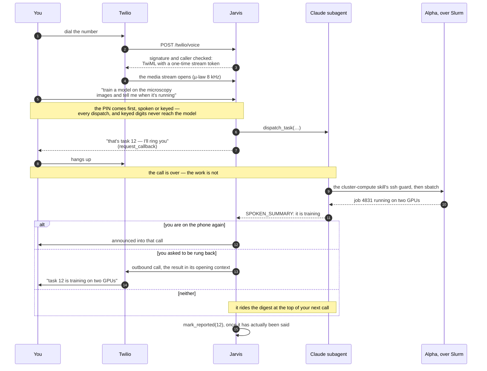
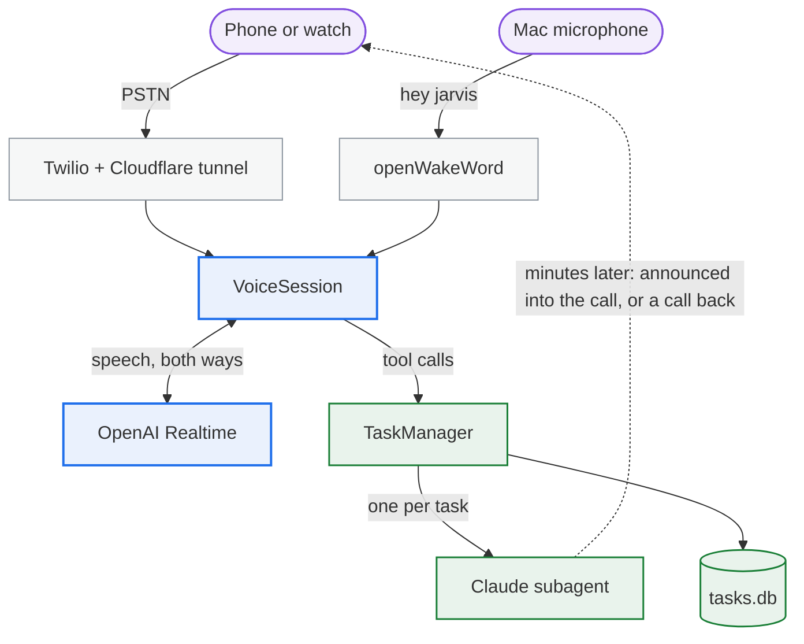

<p align="center">
  
</p>

<h1 align="center">Jarvis</h1>

<p align="center"><em>A personal voice agent you can phone.</em></p>

<p align="center">
  <a href="https://github.com/wak31415/jarvis-voice-agent/actions/workflows/ci.yml"></a>
  <a href="LICENSE"></a>
  
  
</p>

Reach it two ways:

- **By phone** — call a Twilio number (from a watch, a car, anywhere). The call opens a
  realtime voice session.
- **Locally** — say "hey jarvis" to a Mac's microphone and the same session opens
  without a phone.

Speech goes through the **OpenAI Realtime API** (speech-to-speech, server VAD, function
calling), so the conversation stays snappy. Anything that is real work — research, a code
change, mail and calendar chores — is handed to a **Claude Agent SDK subagent** that runs
on the host machine with full local access and reports back by voice or a call back
(or by SMS, which is off unless you set `SMS_ENABLED=true`).

## One request, end to end

Asking for something substantial: a training run that takes hours, started in a call that
lasts a minute.



Steps 9 to 15 happen with nobody on the line, and step 15 is the record that you were
actually told — until it is stamped, task 12 is still waiting at the top of your next call.

The two channels can live on one machine or two. The phone channel runs anywhere —
in practice a Linux box that is up 24/7, reached through a Cloudflare tunnel — while the
wake word needs macOS, because openwakeword cannot be installed on Linux under Python
3.12 (its `tflite-runtime` dependency has no cp312 wheel). On a Linux host `jarvis serve`
says so in one line and serves the phone channel alone.

The full design lives in
`docs/superpowers/specs/2026-08-18-jarvis-voice-agent-design.md`.

**Names.** The repository is `jarvis-voice-agent`; the Python package, the `jarvis` CLI and
the data directory (`~/.jarvis`) all keep the shorter name. It was `garmin-voice-agent`
until 2026-09-02 — the first caller was a Garmin watch — and GitHub still redirects the old
URL. Nothing is published to PyPI or any other index: this is a single-tenant service you
run on your own machine against your own API keys, not a library to depend on, so it is
installed from a clone.

## Architecture



The dotted line is the part that makes this an *agent* rather than a voice interface: work
outlives the call it was asked for in, and comes back on its own.

One `VoiceSession` drives any transport: Twilio media streams (µ-law 8 kHz, passed
through untouched), the local mic/speaker (16-bit PCM 24 kHz, half-duplex — the mic is
gated off while Jarvis speaks), or a WAV file for the `loopback` dev harness. The session
never knows which one it has.

## The tools the voice model can call

There are nineteen, and they fall into two groups that you should treat very differently.

**The core is the machinery of a call** — dispatching work, following it, and getting off
the phone. It is the same for everybody and it is not where you should be making changes:
several of these carry rulings that are easy to break by accident. `mark_reported` in
particular is the only thing that records that a result was actually *said out loud*, and
the digest at the top of your next call depends on it.

<!-- tools:start -->
| Core tool | What it does |
|---|---|
| `dispatch_task` | hand the work to a Claude subagent and get back a task number |
| `list_tasks` | what is queued, running and recently finished |
| `get_task_status` | how one task is getting on |
| `get_task_result` | the spoken summary a finished task produced |
| `send_followup` | add something to a task already in flight |
| `cancel_task` | stop one |
| `mark_reported` | record that a result has now been *said out loud* — the only thing that stops it riding the next call's digest |
| `recall` | search past call transcripts and past task summaries |
| `list_projects` | the project names that can be dispatched into |
| `request_callback` | call back when a task lands |
| `web_search` | answer a small factual question on the spot, through the Responses API |
| `restart_service` | restart Jarvis (after the call ends) |
| `submit_pin` | check a spoken PIN |
| `end_session` | hang up |

**The rest are examples.** They are the tools one person actually wanted, kept here
because they are worked examples of the shape rather than because you need them.
`cluster_stats` reads a Slurm cluster at a university and will mean nothing to you;
`check_billing` reads an API bill; the approval pair is for someone who uses Claude Code
on the same machine. Read them for the pattern, then delete them and write your own.

| Example tool | What it does | Why it is a tool and not a task |
|---|---|---|
| `send_to_slack` | send a written message to the Slack DM — only when asked | the answer belongs somewhere you can read later |
| `check_billing` | what the month has cost, read off the provider's billing API | two numbers, wanted mid-sentence |
| `cluster_stats` | what is free and what is running on the Slurm clusters | same — "is my job still going" is a question, not a job |
| `list_pending_approvals` | what a Claude Code session on the desktop is waiting on | you are being asked, not asking |
| `answer_approval` | read that prompt out and offer the keypad — it cannot approve anything itself | the keypad decides, never the transcription |
<!-- tools:end -->

`check_billing` and `cluster_stats` are deliberately not PIN-gated: they cannot change
anything. Everything that can is.

Slack is opt-in: nothing goes to it unless you asked for it. When you do ask, the voice
sends text with `send_to_slack` and subagents send files, plots and reports through the
same Slack app, which they already have from the `auto-research` skill. Unasked, a file
stays in the written report — Jarvis tells you it is there and offers to send it, rather
than reading a path down the phone.

### One routing decision

Small talk, task status and small factual questions the voice answers itself — `web_search`
goes through the Responses API, because a Realtime session has no hosted search tool of its
own. Everything else becomes a task, and a task is just "Claude, on this machine": one
kind, every tool, the repositories, Gmail and Calendar, the installed skills, and subagents
of its own. Nothing classifies the work in advance.

That is why the example tools are short. **The default answer to "can Jarvis do X" is "ask
Claude to do X"** — a task already has your machine, your repositories, your mailbox and
every skill you have installed. A tool only earns its place when the answer is needed
*inside the call*, in the second or two before a silence gets awkward. Half a minute of
nothing while a subagent goes and looks is the thing a tool exists to avoid, and it is the
only thing it buys you.

### Writing your own

The quickest way is to ask for one out loud:

> *"In the jarvis project, add a tool called `next_train` that reads the departure board
> for my station and tells me the next two trains. Same shape as `check_billing`."*

That is an ordinary task. The subagent has the repository, the tests and this README, and
`prompts/subagent_suffix.md` already tells it how work here is expected to end. It will
need the PIN, like every dispatch from the phone, and a `.py` change needs a restart before
the tool exists — say *"restart yourself"* when it is done and Jarvis will ring you back
once it is up.

What it will do, and what to check if you are writing it by hand:

1. **A new `src/jarvis/tools/builtin_<domain>.py`**, exporting one `register_*` function.
   The existing five are `builtin_comms`, `builtin_billing`, `builtin_tasks`,
   `builtin_restart` and `builtin_session`; `builtin_common` holds the wording, the
   argument parsing and the two gates. If the tool talks to something outside this
   machine, the *client* is a separate module under `src/jarvis/integrations/` —
   `billing`, `cluster`, `slack` and `web_search` are the four that exist — and the
   `builtin_*` module only registers it.
2. **One line in `src/jarvis/tools/builtin.py`**, which is only a composition root. Where
   you put that line matters: *the order it calls the register functions in is the order
   the tools are offered to the model.*
3. **A row in the table above.** `tests/test_docs_sync.py` compares the registrations
   against this README and fails if they disagree, in either direction.
4. **`pin_gate(ctx, settings)` if the tool can change anything.** Read-only tools skip it
   on purpose — asking what a number is should not need a PIN — but anything that acts
   goes through the gate, and a tool that can run a command needs a better reason than
   convenience.
5. **A fake behind a `Protocol`**, never the real service. Nothing in the test suite
   touches the network or hardware; see `jarvis/integrations/billing.py` for a small
   example of the protocol-plus-fake shape and `tests/tools/test_builtin.py` for how it
   is driven.
6. **A description written to be *heard*.** The model reads it to decide when to reach for
   the tool, so say when to use it and when not to. Look at how `check_billing`'s
   description names the actual phrasings — "what am I spending", "what has Claude cost" —
   rather than describing the API it calls.

Two of the example tools are written up end to end as templates to work from:
[`check_billing`](https://github.com/wak31415/jarvis-voice-agent/wiki/Worked-Example-check_billing) for the read-only-API shape, and
[`cluster_stats`](https://github.com/wak31415/jarvis-voice-agent/wiki/Worked-Example-cluster_stats) for reaching outside the machine
safely.

Skills are the other half of this and often the better answer. Anything under `SKILLS_DIR`
is listed in the voice prompt, so a subagent already knows what it is good at without you
naming it — a new skill needs no code here at all, and no restart.

## Setup

### Prerequisites

- macOS or Linux with Python 3.12 and [`uv`](https://docs.astral.sh/uv/) — the wake
  word is macOS-only, the phone channel runs on either
- **OpenAI API key** with Realtime access
- **Claude subscription login** (`claude /login`, once) — subagents run on it by default.
  Alternatives: `claude setup-token` → `CLAUDE_CODE_OAUTH_TOKEN` (headless/launchd), or an
  `ANTHROPIC_API_KEY` (pay-per-token; takes precedence when set)
- The **`claude` CLI** — the Agent SDK drives it, and ships a bundled copy it prefers
  over `PATH`. Install one yourself (`npm i -g @anthropic-ai/claude-code`) only if
  `jarvis doctor` says there is neither
- A **Twilio** account, a phone number, and a **Cloudflare Tunnel** with a hostname
  routed to it — `cloudflared` plus a zone on Cloudflare (for the phone channel). The
  macOS service installer uses **ngrok** instead: `ngrok` plus a reserved ngrok domain
- Gmail and Calendar need nothing: they come from the Claude CLI's claude.ai connectors

### Install

```bash
git clone https://github.com/wak31415/jarvis-voice-agent.git
cd jarvis-voice-agent
uv sync
cp .env.example .env      # then fill it in (see the table below)
uv run jarvis download-models   # macOS only: fetches the openWakeWord "hey jarvis" model
uv run jarvis doctor            # tells you what is still missing
```

`uv sync` builds a Python 3.12 environment from `uv.lock` — nothing here is installed from
a package index. `jarvis doctor` is safe to run before anything is configured; that is what
it is for, and it never prints a secret.

Optional, and only if you use Claude Code on this machine:
`scripts/install-claude-hook.sh` wires up [the approval bridge](#the-approval-bridge), so a
prompt you leave unanswered on screen rings your phone.

### Configuration

Every setting is an environment variable, read from `.env` in the working directory.
`.env.example` lists them all; the ones you must set are:

| Env | What it is |
|---|---|
| `OPENAI_API_KEY` | Realtime API key (required) |
| `ANTHROPIC_API_KEY` | optional — pay-per-token override for subagent auth |
| `CLAUDE_CODE_OAUTH_TOKEN` | optional — subscription token from `claude setup-token` |
| `TWILIO_ACCOUNT_SID` / `TWILIO_AUTH_TOKEN` / `TWILIO_NUMBER` | phone channel + outbound calls (and SMS, only with `SMS_ENABLED=true`) |
| `ALLOWED_CALLERS` | comma-separated E.164 numbers allowed to call in — everything else is refused |
| `JARVIS_PIN` | 6–8 digits; required before Jarvis dispatches anything over the phone |
| `PUBLIC_HOST` | the tunnel hostname Twilio reaches, e.g. `jarvis.example.com` |
| `PROJECTS` | JSON map of spoken project names to repo paths, e.g. `{"jarvis": "/Users/me/code/jarvis"}` |

A project can also introduce itself: put a **`.jarvis-brief.md`** at its root and the voice
prompt carries it verbatim — what the project is, what the jargon means out loud, what
state it is in. Keep it short (it is capped at 1500 characters). Do not point this at a
repository's `CLAUDE.md`: that is thousands of tokens of build detail written for a screen,
the subagent reads it for itself anyway, and in a voice prompt it mostly drowns the persona.

**If Jarvis cuts you off while you think**, that is turn detection. It defaults to
`VAD_MODE=semantic` with `VAD_EAGERNESS=medium`, which waits on whether your sentence
sounds finished rather than on a stopwatch. `VAD_EAGERNESS=low` is more patient still — it
was the default until it turned out to cost about two seconds of silence a turn. If it
feels sluggish instead, `VAD_MODE=server` with `VAD_SILENCE_MS` (default 1200) goes back to
a fixed timer you can tune directly.

Useful optional ones: `HOST`/`PORT` (default `127.0.0.1:8080`), `DATA_DIR` (default
`~/.jarvis`), `PROJECTS_ROOT` (every subdirectory is dispatchable by name), `SKILLS_DIR`
(default `~/.claude/skills`, listed in the voice prompt), `SUBAGENT_MODEL` (default
`claude-opus-5`), `LOG_LEVEL`, `SERVICE_MANAGER`/`SERVICE_UNIT` (which unit
[`jarvis restart`](#restarting-it) asks to restart; `auto` finds it), and the guardrails
below. The full table is spec §3.4.

### Cloudflare tunnel (for the phone channel)

Twilio has to reach this machine, and the tunnel is the only thing exposed. With the
hostname's zone on Cloudflare, create the tunnel once — it opens a browser to authorize:

```bash
cloudflared tunnel login
cloudflared tunnel create jarvis
cloudflared tunnel route dns jarvis jarvis.example.com   # your PUBLIC_HOST
```

That writes credentials under `~/.cloudflared/` and a CNAME in the zone. Put the same
hostname in `.env` as `PUBLIC_HOST`; name the tunnel something else and set
`CLOUDFLARE_TUNNEL` to match. `scripts/dev.sh` and `scripts/install-systemd.sh` run it
for you from there.

**On macOS, the installed service tunnels through ngrok instead.** `scripts/install-launchd.sh`
runs `ngrok http --domain=<PUBLIC_HOST> <PORT>` as its tunnel agent, because a reserved ngrok
domain needs no DNS zone, and it will not install without `ngrok` on `PATH`. Set it up once:

```bash
brew install ngrok
ngrok config add-authtoken <your-token>   # from the ngrok dashboard
```

then reserve a domain in the ngrok dashboard and put it in `.env` as `PUBLIC_HOST`.
`CLOUDFLARE_TUNNEL` is not used there, and `scripts/dev.sh` still runs cloudflared on either
platform.

### Twilio console

1. Buy (or open) a number → **Voice & Fax → A call comes in**:
   `https://<PUBLIC_HOST>/twilio/voice`, method **HTTP POST**.
2. **Call status changes**: `https://<PUBLIC_HOST>/twilio/status`, method **HTTP POST**.
3. The tunnel hostname is a DNS record you own, so the webhook URL never changes.

Both webhooks are validated against the Twilio signature; `/twilio/voice` additionally
refuses callers outside `ALLOWED_CALLERS`, and the media-stream socket needs a one-time
token minted by `/twilio/voice` for that very call, so a stray connection to the tunnel
gets nothing.

### Google (Gmail and Calendar)

Nothing to set up: the Claude CLI carries your authorized **claude.ai connectors** (Gmail,
Calendar, Drive, and whatever else you have connected), and every subagent inherits them.
Ask for mail or calendar work and it just happens.

The older path — a `workspace-mcp` stdio server of our own — is still in the tree but off
(`GOOGLE_WORKSPACE_MCP=false`). Turn it on only if your subagents authenticate with an
`ANTHROPIC_API_KEY` rather than the subscription login, since the connectors come with that
login; setting that up is a page of its own,
[Google Workspace MCP](https://github.com/wak31415/jarvis-voice-agent/wiki/Google-Workspace-MCP).

## Running

```bash
uv run jarvis serve                  # phone server + "hey jarvis" listener
uv run jarvis serve --no-phone       # local wake word only
uv run jarvis serve --no-wakeword    # phone only (no mic needed)
uv run jarvis serve --fake-agents    # scripted subagents: no Claude tokens spent
uv run jarvis serve --host 0.0.0.0 --port 9000   # override HOST/PORT from .env
```

For the phone channel you also need the tunnel. `scripts/dev.sh` runs both — it starts
the Cloudflare tunnel (logging to `.cloudflared.log`) and `jarvis serve --no-wakeword`,
passing any extra flags through:

```bash
scripts/dev.sh
```

### Keeping it running

```bash
scripts/install-systemd.sh      # Linux: two user units, enabled and started
scripts/install-launchd.sh      # macOS: two launch agents, loaded
```

Each installer renders the templates under `ops/` into the user's own service directory,
starts them, and arranges for them to survive a logout and come back after a reboot. Both
take `--uninstall`. The service gets the `PATH` of the shell you run the installer from, so
subagents find the same tools a terminal does (nvm, Homebrew, conda, cargo…), and logs to
`DATA_DIR/logs/`; run the installer again after changing either. What exactly they render, where each one logs, and why the macOS tunnel
agent runs ngrok while the Linux one runs cloudflared:
[Running as a service](https://github.com/wak31415/jarvis-voice-agent/wiki/Running-as-a-Service).

On macOS, grant the terminal — and, once installed, the launch agent — **microphone**
permission in System Settings → Privacy & Security, or the wake word never hears anything.

### Restarting it

```bash
uv run jarvis restart --reason "picked up new code"
uv run jarvis restart --status     # how the last one went
```

A `.py` change does not take effect until the process restarts, and the process is usually
the thing that just made the change — so this is a first-class operation that reports back
on itself. **Jarvis phones you back once it is up again**, with how long it was down, the
version before and after, which channels are listening, and how many tasks the restart
interrupted. You can also just ask on the phone — *"restart yourself"* — and that one waits
until you have hung up, because a restart drops every call in progress. Nothing rings while
you are already talking to Jarvis: a confirmation that lands during a call is spoken into
that call instead.

Nothing supervising the process — a `jarvis serve` you started in a terminal, even on a
machine where the service is installed too — means `restart` refuses in one sentence,
because stopping would leave nothing to start it again. `jarvis doctor` says which case
you are in. How it knows
whether the change actually *loaded*, what happens when the service never comes back at
all, and why a `-15` exit code is the restart working:
[Restarting Jarvis](https://github.com/wak31415/jarvis-voice-agent/wiki/Restarting-Jarvis).

## Using it

Call the number, or say **"hey jarvis"** at the Mac. Then talk normally:

- *"What's on my plate today?"* — answered directly.
- *"What's the dollar-euro rate?"* — answered on the spot with `web_search`, no task.
- *"Look into how Twilio handles media stream reconnects and summarise it."* — a task.
- *"In the jarvis project, add a retry to the report fetch and run the tests."* — a task
  (PIN required on the phone, as every task is).
- *"Check my mail for the papers the group sent, summarise each one, and tell me."* — one
  task: the same subagent reads the mailbox, uses the `ingest-paper` skill and fans out
  subagents of its own.
- *"What's running?"* / *"How did task 3 go?"* — task status and results.
- *"Add to task 3: also update the README."* — a follow-up into the same subagent.
- *"Call me back when it's done."* — an outbound call when the task lands.
- *"Send me that on Slack."* — the message arrives in your DM; a file or plot is sent by
  the subagent that made it. Only asking gets you one: Jarvis never sends unprompted.
- *"Goodbye."* — ends the session (locally it also ends after 30 s of silence).

And two that are somebody's own tools rather than part of the machinery, kept as worked
examples of what one looks like — see [Writing your own](#writing-your-own):

- *"What am I spending this month?"* — read straight off the provider's billing API with
  `check_billing`; the tool end to end is
  [a worked example](https://github.com/wak31415/jarvis-voice-agent/wiki/Worked-Example-check_billing).
- *"What's free on Alpha?"* / *"Am I still running on Beta?"* — read straight off Slurm
  with `cluster_stats`; likewise
  [a worked example](https://github.com/wak31415/jarvis-voice-agent/wiki/Worked-Example-cluster_stats).

**Anything that is work goes straight to Claude.** Jarvis does not repeat the request back
for a yes, ask which file you mean, or argue about the approach — it dispatches and tells
you it has. If you did not name a project the task starts in `PROJECTS_ROOT` and the
subagent finds the repo itself; the voice prompt already knows every project name there,
so "in the splatting repo" is enough. It also knows every skill installed under
`SKILLS_DIR`, so work a skill covers — a sweep, a profile, a cluster job — is recognised
without you naming the skill.

The questions you get asked are the ones Claude worked out, not the ones the voice model
imagined. A subagent that hits a decision only you can make does everything else first,
then ends with one spoken question; Jarvis asks it and sends your answer back into the
same session as a follow-up.

Short tasks answer inline; longer ones come back as an announcement in whatever session is
live, and as a call back if you asked for one. Texting is off by default: with
`SMS_ENABLED=true` an SMS with a link to the written report comes too.

**The PIN.** On the phone, dispatching anything is refused until you authorize: say the
PIN or key it in on the keypad. Keyed digits are collected in the session and never enter
the model transcript. Local sessions are pre-authorized — you are already at the machine.

`JARVIS_PIN` must be **6 to 8 digits and nothing else**, and that is enforced rather than
advised: `jarvis serve` refuses to start on anything else, and `jarvis doctor` says which
rule was broken. Three wrong entries end the call, and the session stays locked even if the
right PIN arrives afterwards. Why those particular rules, and what leaving it unset means
instead, is in
[the security model](https://github.com/wak31415/jarvis-voice-agent/wiki/Security-Model).

### From the terminal

```bash
uv run jarvis tasks list              # 20 most recent; TOLD is NO until Jarvis has said it
uv run jarvis tasks show 12           # every field, plus the written report
uv run jarvis memory                  # what Jarvis carries between calls
uv run jarvis doctor                  # is this machine set up?
uv run jarvis forget --older-than 30  # delete old transcripts and finished tasks
```

These read the SQLite store and the data directory directly, so they work whether or not
the server is running. Every command and what each is for:
[Command line reference](https://github.com/wak31415/jarvis-voice-agent/wiki/Command-Line-Reference).

## The approval bridge

Everything above carries a result *outwards* from work you asked for. This runs the other
way. A Claude Code session on your own screen has stopped and is asking *you* something —
"may I run this?", "which of these three?" — and you are not at the keyboard. Five minutes
later, Jarvis rings you about it, reads the question out, and lets you answer on the
keypad.

```bash
scripts/install-claude-hook.sh              # add the hook to ~/.claude/settings.json
scripts/install-claude-hook.sh --uninstall  # take it out again
uv run jarvis approvals                     # the audit trail
uv run jarvis approvals --disable           # kill switch, effective on the next prompt
```

It is optional, and it is off on any machine that never installs the hook. Four rulings
hold it up, and none of them is a preference:

- **A Unix socket, never an HTTP route.** `cloudflared` puts the whole of port 8080 on the
  internet. `~/.jarvis/approvals.sock` at mode 0600 is unreachable through it by
  construction.
- **`policy.py` is an allowlist, and it is the *primary* control.** Nothing downstream
  re-checks it, so whatever it calls eligible is exactly what a keypad digit can run.
  Widening it widens that.
- **The keypad decides, never the transcription.** `answer_approval` cannot answer
  anything; the most it does is put a menu in the model's mouth. A television in the
  background cannot press a key.
- **Failure is always "do nothing".** Broker down, call unanswered, hook crash: every one
  of them ends with the hook printing nothing, which leaves the on-screen prompt exactly as
  it was.

The sequence diagram, what the allowlist actually contains, the tuning settings and the
reasoning behind each of those four:
[The approval bridge](https://github.com/wak31415/jarvis-voice-agent/wiki/The-Approval-Bridge).

## Security model

- **The subagents run as you.** They use `permission_mode="bypassPermissions"`, so a
  task has your full user access to files, repos, and the network. Treat "who can
  reach Jarvis" as "who can run commands on this machine".
- **What the tunnel exposes** is only: `/twilio/voice` (Twilio signature-validated *and*
  caller-allowlisted), `/twilio/status` (signature-validated only — it carries no caller
  to check), `/twilio/media` (needs a one-time, 60-second stream token minted by
  `/twilio/voice` for the same call), `/reports/{id}?t=…` (HMAC-signed link, the one sent
  by SMS when `SMS_ENABLED` is on), and `/health`, which is unauthenticated and answers
  with `ok` plus the number of live sessions. Nothing else is served: FastAPI's interactive docs and its
  `/openapi.json` schema are both switched off, so the tunnel does not hand out a list of
  the routes above.
- **Caller ID is spoofable**, so the allowlist alone is not a gate. The PIN is what
  actually protects dispatching on the phone. It must be 6–8 digits (enforced — see
  [The PIN](#using-it)), three wrong entries end the call for good, and it is compared with
  `hmac.compare_digest`. Keep `ALLOWED_CALLERS` tight and leave `JARVIS_PIN` set — with no
  PIN configured, every dispatch is simply refused over the phone.
- Secrets are never logged, the PIN is compared with `hmac.compare_digest`, and the report
  signing secret is either `REPORT_SECRET` or a random one persisted at
  `~/.jarvis/report_secret` with mode 600. Caller phone numbers are masked to their last
  four digits everywhere they are written down.

Three things this summary leaves out are in the wiki: the PIN rules in full, on
[Security model](https://github.com/wak31415/jarvis-voice-agent/wiki/Security-Model);
what is written to disk and what leaves the machine, on
[Data and retention](https://github.com/wak31415/jarvis-voice-agent/wiki/Data-and-Retention);
and where building this for one person on one machine shows through, on
[Assumptions and deployments](https://github.com/wak31415/jarvis-voice-agent/wiki/Assumptions-and-Deployments)
— which is worth reading before you deploy it anywhere.

## Costs

- **Realtime voice** is the running cost of a call: roughly **$0.06–0.11 per minute** of
  conversation, audio in and out. A five-minute call is well under a dollar; leaving the
  wake-word listener on costs nothing until a session actually opens.
- **Subagents** run on your Claude subscription by default (they count against the plan's
  usage limits, not per-token billing); with `ANTHROPIC_API_KEY` set they are pay-per-token
  instead. `claude-opus-5` is the default; ask for `sonnet` or `haiku` out loud for
  cheaper work.
- **Ask it what it is spending** — *"what's the bill this month?"* reads the real figure
  off the provider's billing API. See the worked example for
  [`check_billing`](https://github.com/wak31415/jarvis-voice-agent/wiki/Worked-Example-check_billing).
- Guardrails that keep a bad day from becoming an expensive one:

  | Setting | Default | What it caps |
  |---|---|---|
  | `MAX_CALL_SECONDS` | 1800 | a phone call's length — Jarvis is told to wrap up 30 s before, then hangs up |
  | `SUBAGENT_MAX_TURNS` | 200 | agent turns in one task |
  | `SUBAGENT_MAX_BUDGET_USD` | 10.0 | dollars one task may spend |
  | `DAILY_TASK_CAP` | 50 | tasks dispatched per day |
  | `MAX_CONCURRENT_TASKS` | 3 | subagents running at once; the rest queue |

## Troubleshooting

Start with:

```bash
uv run jarvis doctor        # add --no-mic on a machine with no microphone
```

It checks `.env`, both API keys, the `claude` CLI, Twilio, `PUBLIC_HOST`, a tunnel binary,
the caller allowlist, the PIN, the wake-word model, the microphone, that `~/.jarvis` is
writable and readable by nobody else, which service manager it found, and whether Google
credentials exist. `✅` is fine, `⚠️` narrows what Jarvis can do (no mic, no PIN, no Google,
no `claude` CLI), `❌` means it will not work — and only `❌` makes the command exit
non-zero. It is safe to run before anything is configured; that is what it is for, and it
never prints a secret.

The server log is `DATA_DIR/logs/jarvis.log` (`~/.jarvis/logs/` by default), rotated at
10 MB × 5. Where everything else
is written, and the common failures with what each one actually means:
[Troubleshooting](https://github.com/wak31415/jarvis-voice-agent/wiki/Troubleshooting).

## Development

```bash
uv run pytest -q               # must be green with no warnings
uv run ruff check src tests
uv run jarvis serve --fake-agents   # scripted subagents, no Claude tokens
uv run jarvis loopback --wav sample.wav --out reply.wav
```

Tests never touch the network, a microphone, or a real subagent: OpenAI, Twilio,
sounddevice, openWakeWord, and the Agent SDK all sit behind injectable interfaces with
fakes.

## Documentation

This README is the front door. The manual is the [wiki](https://github.com/wak31415/jarvis-voice-agent/wiki),
which is a separate git repository and so does not arrive with a `git clone`:

| Page | What is on it |
|---|---|
| [Running as a service](https://github.com/wak31415/jarvis-voice-agent/wiki/Running-as-a-Service) | the systemd and launchd units, what they render, where they log |
| [Restarting Jarvis](https://github.com/wak31415/jarvis-voice-agent/wiki/Restarting-Jarvis) | the call back, the version stamp, and the watchdog for a restart that never lands |
| [Command line reference](https://github.com/wak31415/jarvis-voice-agent/wiki/Command-Line-Reference) | every `jarvis` command and what it is for |
| [Troubleshooting](https://github.com/wak31415/jarvis-voice-agent/wiki/Troubleshooting) | `jarvis doctor`, where everything is written, and the common failures |
| [The approval bridge](https://github.com/wak31415/jarvis-voice-agent/wiki/The-Approval-Bridge) | the sequence, the allowlist, the kill switch, the tuning |
| [Security model](https://github.com/wak31415/jarvis-voice-agent/wiki/Security-Model) | what the tunnel exposes, and the PIN rules in full |
| [Data and retention](https://github.com/wak31415/jarvis-voice-agent/wiki/Data-and-Retention) | what is on disk, what leaves the machine, how to delete it |
| [Assumptions and deployments](https://github.com/wak31415/jarvis-voice-agent/wiki/Assumptions-and-Deployments) | where one person's deployment shows through |
| [Worked example: `check_billing`](https://github.com/wak31415/jarvis-voice-agent/wiki/Worked-Example-check_billing) | a read-only API tool, end to end |
| [Worked example: `cluster_stats`](https://github.com/wak31415/jarvis-voice-agent/wiki/Worked-Example-cluster_stats) | reaching outside the machine safely |
| [Google Workspace MCP](https://github.com/wak31415/jarvis-voice-agent/wiki/Google-Workspace-MCP) | the legacy Gmail/Calendar path, off by default |

**Rulings live in the repository, not the wiki.** The design spec at
`docs/superpowers/specs/2026-08-18-jarvis-voice-agent-design.md` is the authority on why
anything here is the way it is, and it travels with a clone;
`docs/superpowers/plans/2026-08-18-jarvis-voice-agent-plan.md` is how it was built. Wiki
pages cite the relevant section rather than restating it as their own.

## Contributing

[CONTRIBUTING.md](CONTRIBUTING.md) has the setup, the conventions and the two rules that
are not negotiable (no network or hardware in a test; rulings live in the design spec).
[CODE_OF_CONDUCT.md](CODE_OF_CONDUCT.md) applies to everyone taking part.

**Found a security problem?** Do not open an issue — use the repository's **Security** tab
→ *Report a vulnerability*. [SECURITY.md](SECURITY.md) says what is in scope and what to
expect.

## Licence

[Apache License 2.0](LICENSE) — Copyright 2026 William Koch.

Apache-2.0 rather than MIT for two things MIT does not give you: an explicit patent
grant from every contributor, and a trademark clause, which matters because "Jarvis" is a
name with prior art all over it. Use the code; the name is not part of the grant.

No third-party code is vendored into this repository. Everything else arrives through
`pyproject.toml` under its own licence.
