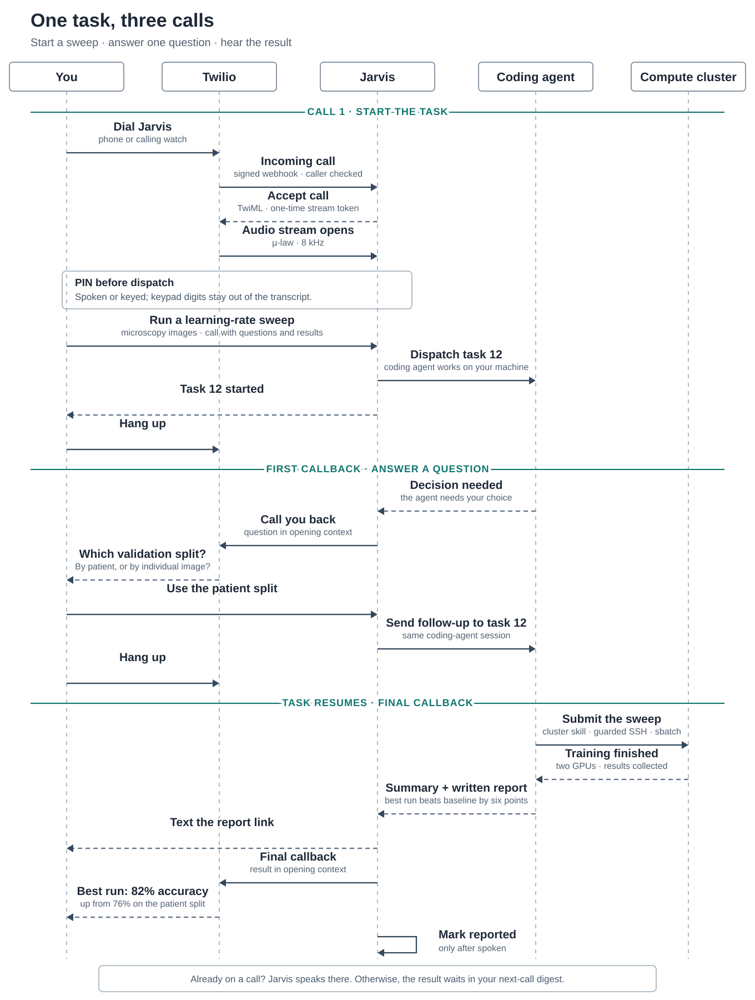

<p align="center">
  
</p>

<h1 align="center">Jarvis</h1>

<p align="center"><em>A personal voice agent that keeps working after you hang up.</em></p>

<p align="center">
  <a href="https://github.com/wak31415/jarvis-voice-agent/actions/workflows/ci.yml"></a>
  <a href="LICENSE"></a>
  
  
</p>

Start hours of work in a short call. Ask Jarvis to research a question, change code, or run
an experiment, then hang up. It keeps working, lets you check in or add instructions later,
and can call you back or text you the report when it's done.

Jarvis uses the OpenAI Realtime API for conversation and coding agents on your machine for
the work. Call it from a phone or a watch that can place calls, or say "hey jarvis" at your
Mac.

## What Jarvis adds

Jarvis turns the [Realtime API](https://developers.openai.com/api/docs/guides/realtime) into
a voice agent you can use across calls:

| Feature | Realtime API | ChatGPT Voice | Jarvis |
| --- | :---: | :---: | :---: |
| Live voice conversation and tools | ✅ | ✅ | ✅ Uses Realtime API |
| Phone calls, including from calling watches | 🟡 SIP setup | 🟡 1-800-CHATGPT, US/CA | ✅ |
| Email, calendar and Slack by voice | 🟡 via MCP | ✅ | ✅ |
| **Tasks that continue after you hang up** | — | ✅ in Work | ✅ |
| Status and follow-ups in a later call | — | 🟡 in the app | ✅ |
| SMS links to written reports | — | — | ✅ |
| Callbacks when you ask for one | — | — | ✅ |
| Ask it to add a feature during a call | — | — | ✅ |

For example:

> *"In the imaging project, run a learning-rate sweep on the microscopy images. Call me if
> you need a decision, and again when training finishes with a quick summary of the results."*

> *"Find the papers my group emailed this week, turn them into a reading-group presentation
> with polished animations and some discussion questions, and send it to me on Slack."*

> *"Add a voice command that checks whether my home server is up. Build it in the Jarvis
> project and run the tests."*

> *"One more thing: include GPU memory use in that sweep comparison."*

## A short call, a long task

This example shows a task continuing across calls: Jarvis asks one question, then calls
again with the training results.

<picture>
  <source media="(prefers-color-scheme: dark)" srcset="docs/assets/jarvis-call-flow-dark.svg">
  
</picture>

## Quick start

You need Python 3.12, [uv](https://docs.astral.sh/uv/), an OpenAI API key with Realtime
access, and a Claude login. The wake word runs on macOS; phone calls work on macOS or Linux
and also need Twilio and a Cloudflare tunnel.

```bash
git clone https://github.com/wak31415/jarvis-voice-agent.git
cd jarvis-voice-agent
uv sync
cp .env.example .env
```

Add `OPENAI_API_KEY` to `.env` and sign in once with `claude /login`. For a server without
an interactive login, `.env.example` lists token and API key options. Check your setup with:

```bash
uv run jarvis doctor
```

Optionally, tell Jarvis about yourself before the first call with `uv run jarvis init`, or
let Claude Code interview you with the skill in `skills/jarvis-onboard` (copy it into
`~/.claude/skills/`). Otherwise the first call opens with a short introduction.

### Talk locally on a Mac

```bash
uv run jarvis download-models
uv run jarvis serve --no-phone
```

Say "hey jarvis" to start a session. Give your terminal microphone access in macOS System
Settings when prompted.

### Call Jarvis by phone

1. Add your Twilio credentials, phone number, allowed callers, PIN, and public hostname to
   `.env` (see [Configuration](#configuration)).
2. Install `cloudflared` and create a tunnel for a hostname in a Cloudflare-managed domain:

   ```bash
   cloudflared tunnel login
   cloudflared tunnel create jarvis
   cloudflared tunnel route dns jarvis jarvis.example.com
   ```

   Set `PUBLIC_HOST=jarvis.example.com` in `.env`, using your own hostname.
3. In Twilio, set the number's incoming voice webhook to `https://<PUBLIC_HOST>/twilio/voice`
   and its call-status webhook to `https://<PUBLIC_HOST>/twilio/status`. Use HTTP POST for
   both.
4. Run `uv run jarvis doctor --no-mic` on a machine without a microphone, then start the
   server and tunnel with `scripts/dev.sh`.

For a setup that starts automatically after a reboot, see the
[wiki](https://github.com/wak31415/jarvis-voice-agent/wiki).

## Configuration

`.env.example` lists all available settings. For phone calls, set `TWILIO_ACCOUNT_SID`,
`TWILIO_AUTH_TOKEN`, `TWILIO_NUMBER`, `ALLOWED_CALLERS`, `JARVIS_PIN`, and `PUBLIC_HOST`.
Use a 6–8 digit PIN and list allowed callers in E.164 format. You can also set `PROJECTS`
to give your repositories names you can say aloud. Texting is off until you set
`SMS_ENABLED=true`, since many Twilio accounts can't send SMS in every region.

Tasks run with your user account's access to files and the network. Keep the caller list
narrow and the PIN enabled. Read the wiki's
[security guidance](https://github.com/wak31415/jarvis-voice-agent/wiki/Security-Model)
before putting the phone channel online.

Voice calls incur OpenAI API charges. Coding-agent tasks count against your Claude
subscription limits by default, or use token billing if you set `ANTHROPIC_API_KEY`.

## Extend Jarvis

You can ask Jarvis to add a feature while you're on the phone. For example:

> *"In the jarvis project, add a tool that tells me when the next train leaves my station."*

Jarvis turns the request into a task for a coding agent, which can update the code and run
the tests. When the change is ready, ask Jarvis to restart so the new tool becomes
available. You can also expand what tasks can do by adding skills or connected services for
the agent to use. [`docs/tools.md`](docs/tools.md) lists the tools the voice model has and
how to write one by hand; the [wiki](https://github.com/wak31415/jarvis-voice-agent/wiki)
has worked examples.

## More information

- [Wiki](https://github.com/wak31415/jarvis-voice-agent/wiki) for setup, troubleshooting,
  security, and examples.
- [Contributing guide](CONTRIBUTING.md) for development and pull requests.
- [Security policy](SECURITY.md) for reporting vulnerabilities.

Licensed under [Apache 2.0](LICENSE).
